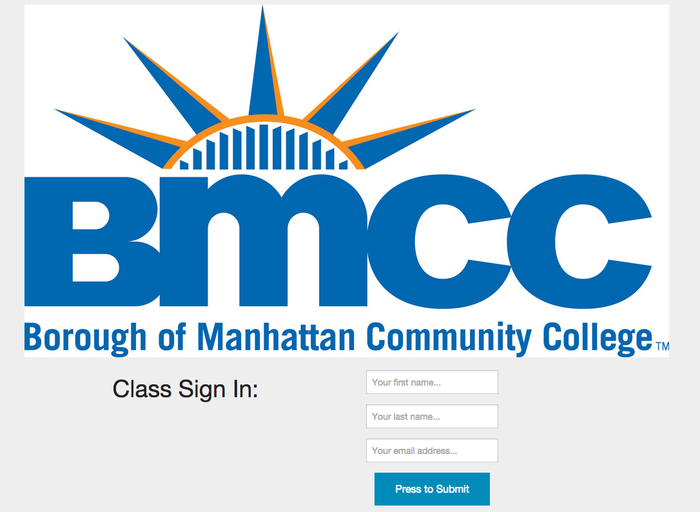

## Simple Rails Attendance App

## Summary

Simple Rails Attendance App is an attendance sign in sheet built entirely on Ruby on Rails. This is a very simple app that doesn't require the end user to create another user account. There is no database to maintain and users are sent a confirmation email to confirm their attendance. 

The inspiration for the app came while as a student who noticed that it was a waste of time when instructors would take time out of class to take attendance when it should be up to the student to ensure they were marked as present.

Built with straight up HTML / CSS / Zurb Foundation on the frontend and Ruby on Rails on the backend. The Mailchimp API is utilized to keep and store the list of attendees and email class sign in confirmations. The Gmail API is utilzied on the website contact form.

Hosted on Heroku.

---
Developed by [Matthew Day] (http://unlimitedday.com)